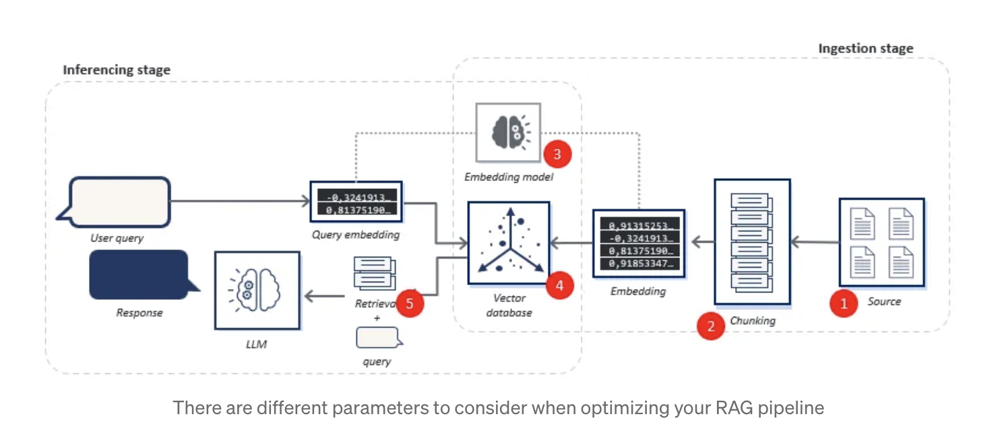
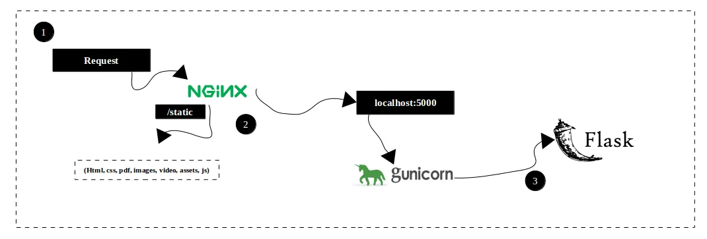

# Requirement 
-- Flask

--React: https://react.dev/

--Heroku ($\textcolor{green}{\text{account setup, needs payment to start with new application deployment serup}}$)
  * Example deployment Flask with Heroku: https://realpython.com/flask-by-example-part-1-project-setup/#deploying-the-application-to-heroku $\textcolor{green}{\text{(didn't finish pipeline part)}}$

-- Google cloud platform (Google app Engine)

--AWS (Amazon web services (further in future))

## Flask URL deployment (Routing):
-- create basic and dynamic routes;

-- map URL with different functionalities

-- (https://www.sitepoint.com/flask-url-routing/) handle various requests types + produce appropriate responses based on user requests;

-- customer requests URL; (enter the web link to render the function)

--bluenprint is better than app.route(), remember to register them based on needs;

### $\textcolor{orange}{\text{Flask URL deployment examples:}}$
-- with model and pipeline incorporation: https://medium.com/@agulyamova/deploying-classification-model-with-flask-1a694d3534a2

## Flask connection with backend:
-- to vector database 

-- to LLM model

### $\textcolor{orange}{\text{Frontend to Backend connection Examples}}$
(&check; indicates importance)

-- https://medium.com/@t.d.benard91/turning-chatgpt-into-a-rag-machine-connecting-chatgpt-via-apis-to-your-vector-database-b8f7242971d4

-- &check; https://medium.com/@ranadevrat/creating-a-chatbot-using-open-source-llm-and-rag-technology-with-lang-chain-and-flask-ca2f5511e82e
   
   >-- &check; https://medium.com/@ranadevrat/build-a-chatbot-with-advance-rag-system-with-llamaindex-opensource-llm-flask-and-langchain-1bf875be3ec6

-- https://shwinda.medium.com/build-a-full-stack-llm-application-with-openai-flask-react-and-pinecone-part-2-ceda4e290c33

## Gateway and web server: 
-- https://faun.pub/deploy-flask-app-with-nginx-using-gunicorn-7fda4f50066a 
   ### Architecture:
   

   * Gunicorn: WSGI server
   * Nginx: Reverse proxy, HTTP cache, and load balancer
   * Dockerize application: https://tasnuva2606.medium.com/dockerize-flask-app-4998a378a6aa 

## Other Examples:
   * SQL with flask: https://www.ffnext.io/blog/python-backend-with-flask-for-beginners

## DEPLOYMENT:
-- Deployment with model:
   * https://towardsdatascience.com/how-to-deploy-large-size-deep-learning-models-into-production-66b851d17f33

-- Deployment with vector databases: (choices of online ddatabases)
   * https://aws.amazon.com/free/database/?gclid=CjwKCAjwgdayBhBQEiwAXhMxtvfJwG_ouLnjOtg7Da9atbvd-P7rxrp5NuGPaR8Bnxw9e3hlLXT07RoCjm0QAvD_BwE&trk=38815c3d-dd2c-470a-aad5-ace47ad8c677&sc_channel=ps&ef_id=CjwKCAjwgdayBhBQEiwAXhMxtvfJwG_ouLnjOtg7Da9atbvd-P7rxrp5NuGPaR8Bnxw9e3hlLXT07RoCjm0QAvD_BwE:G:s&s_kwcid=AL!4422!3!646547068069!p!!g!!website%20database!14856489069!134760404864
   
-- pinecone

