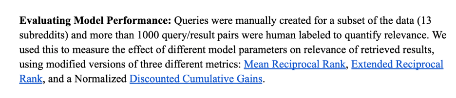

Resources:
1.	https://openai.com/index/new-and-improved-embedding-model/
text-embedding-ada-002 text embedding model;
2.	https://huggingface.co/thenlper/gte-large
gte-large text embedding model
3.	LanceDB: https://lancedb.com/ 
4.	Pinecone;
*Check storage;
Speed; efficiency;

--Algorithms: introduction of embedding
1.	Latent semantic analysis (LSA) --ingular value decomposition of the term-document matrix (fancy linear algebra, basically);
2.	 Latent Dirichlet allocation (LDA) --a statistical method called the Dirichlet process;
3.	Word2vec; Word2vec essentials
--Methodology/architecture: 
1.	Neural methods:
•	Well defined algorithms from the above to map bag-of-words to vector space of our embedding;
	input wordsvector in embedding space;
•	training data  which should be closer, which should be farther  adjust input vectors during training;
2.	Deal with sequences:
•	Sequential models: 
--tokens (fully recurrent neural network);
--transformer; capture context and dependencies in a sequence; run in parallel with tensor operations; attention mechanism: token influence between each other;

Performance metrics: (metric choice & visualization)
1.	Evaluate LLM’s effectiveness and accuracy in handling queries;

2. visualization:
* PCA: linear;
* t-NSE: nonlinear;
https://medium.com/@violante.andre/an-introduction-to-t-sne-with-python-example-47e6ae7dc58f 

Updates:
1.	LanceDB installed;
