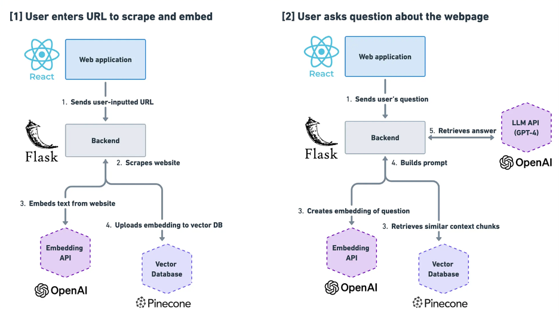
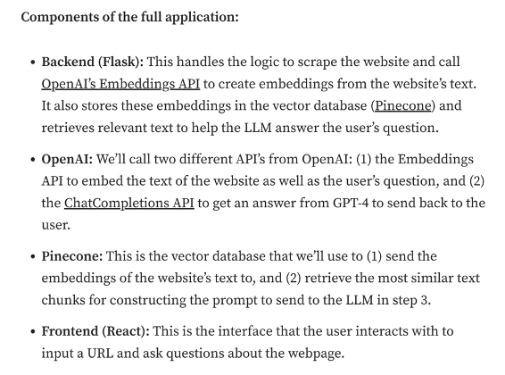

Web development for Chatbot:
Flask: Chatbot Flask web deployment
 
1.	Web scraping (an example case where user want to ask info of website) and call OpenAI's Embeddings API to create embeddings from the website's text.
2.	It also stores these embeddings in the vector database (Pinecone) and retrieves relevant text to help the LLM answer the user's question.

Project structure: replace embedding from openAI with ours embedding; and sent it to our vector databases;

Resources:
1.	Flask documentation:
https://flask.palletsprojects.com/en/3.0.x/ 
Flask web framework example:
https://colab.research.google.com/drive/1JW21xBkM6ELVAH3TtMHVBkUyte-WT5kP#scrollTo=5Ou19wfS9PDe 

Updates:
1.	Flask installed;
2.	Linked Flask route with html templates;

Codes practice reference:
1.	https://medium.com/@mailsushmita.m/create-an-generative-ai-chatbot-using-python-and-flask-a-step-by-step-guide-ea39439cf9ed 

