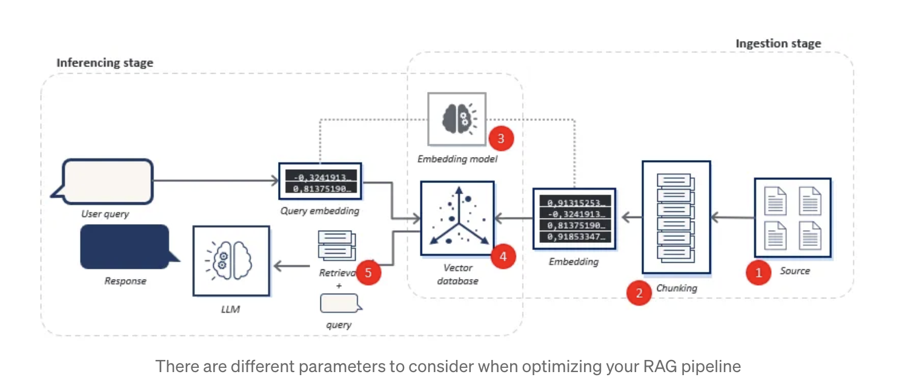

# Requirement 
-- Flask

--React: https://react.dev/

--Heroku ($\textcolor{green}{\text{account setup, needs payment to start with new application deployment serup}}$)
  * Example deployment Flask with Heroku: https://realpython.com/flask-by-example-part-1-project-setup/#deploying-the-application-to-heroku $\textcolor{green}{\text{(didn't finish pipeline part)}}$

-- Google cloud platform (Google app Engine)

--AWS (Amazon web services (further in future))

## Flask URL deployment (Routing):
-- create basic and dynamic routes;

-- map URL with different functionalities

-- (https://www.sitepoint.com/flask-url-routing/) handle various requests types + produce appropriate responses based on user requests;

-- customer requests URL; (enter the web link to render the function)

--bluenprint is better than app.route(), remember to register them based on needs;

### $\textcolor{orange}{\text{Flask URL deployment examples:}}$
-- with model and pipeline incorporation: https://medium.com/@agulyamova/deploying-classification-model-with-flask-1a694d3534a2

## Flask connection with backend:
-- to vector database 

-- to LLM model

### $\textcolor{orange}{\text{Frontend to Backend connection Examples}}$
-- https://medium.com/@t.d.benard91/turning-chatgpt-into-a-rag-machine-connecting-chatgpt-via-apis-to-your-vector-database-b8f7242971d4

## Gateway and web server: 
-- https://faun.pub/deploy-flask-app-with-nginx-using-gunicorn-7fda4f50066a 
   ### Architecture:
   

   * Gunicorn: WSGI server
   * Nginx: Reverse proxy, HTTP cache, and load balancer
   * Dockerize application: https://tasnuva2606.medium.com/dockerize-flask-app-4998a378a6aa 

## Other Examples:
   * SQL with flask: https://www.ffnext.io/blog/python-backend-with-flask-for-beginners

